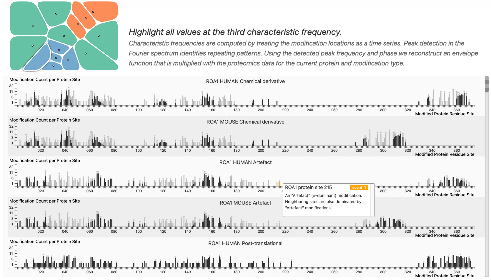

# Steerable Mouse-Human Hybrids

Visualizing proteomics data.




### More ideas

We can extend the originally square control area and make it look like the controls from enterprise.

Add a control to show a single protein at a time.

The diversity index (color by location) could be computed on two levels, single modification locations or on some averaged location, picking the winner of the most frequent modification at a given averaging length.

A motif detection could apply to individually picked locations. We would highlight all matches to the current motifs around the current location.

### Build

This project depends on a web-server like the one included in php. Start the single web-application using:

```bash
php -S localhost:3000
```

and open a web-browser with the url "http://localhost:3000".
